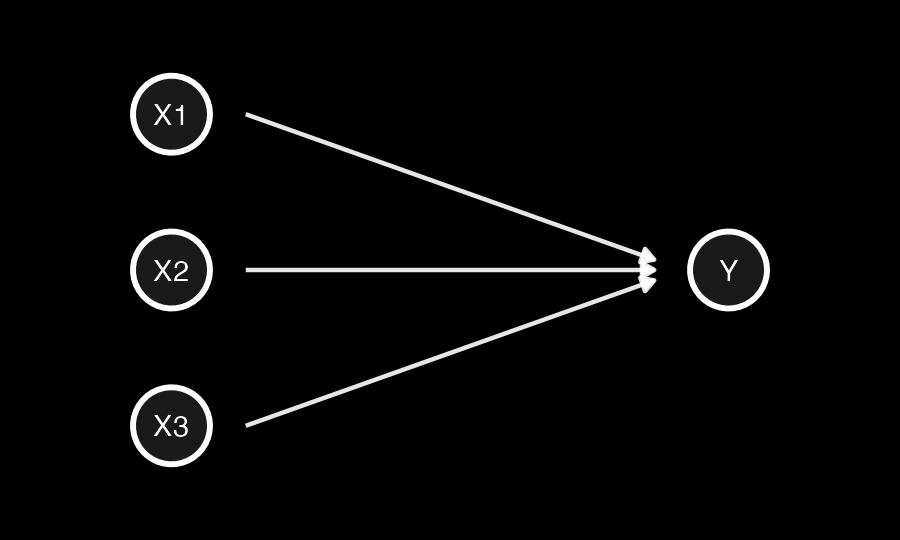
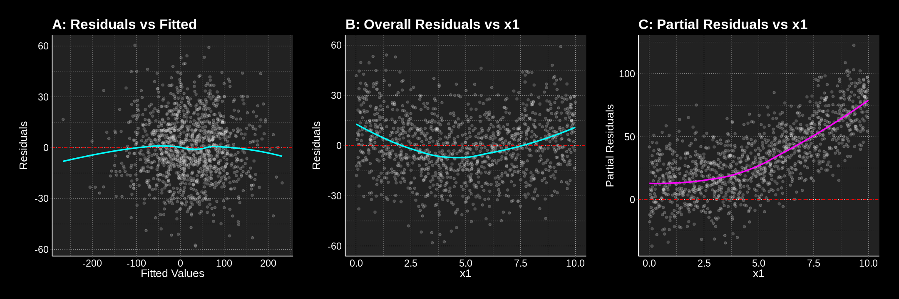
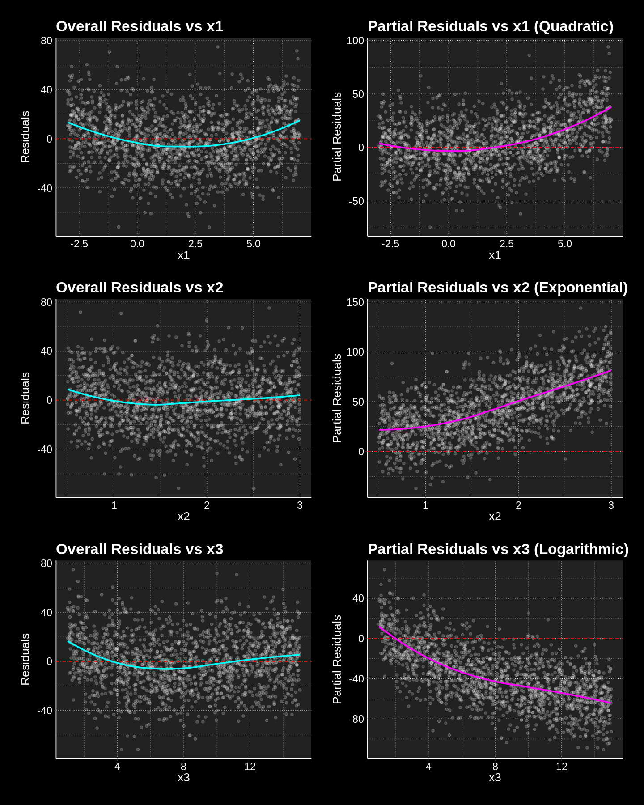
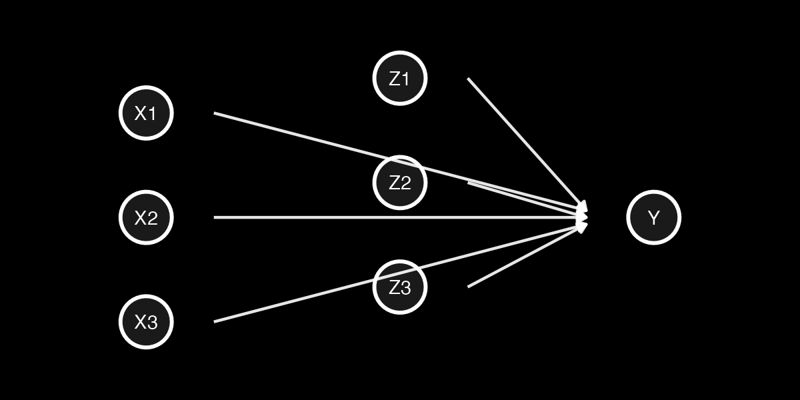
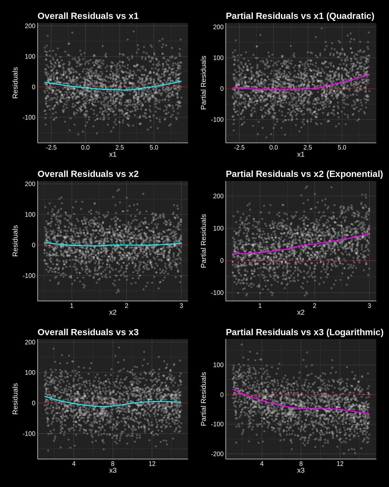

In a previous post, "Your Model Error is Not Just Noise", I provided a short analytical demonstration that regression residuals should not be considered a post-fitting nuisance; instead, they contain valuable information that the analyst may have failed to factor into their model. 

The concept of partial residuals directly extends this understanding. While standard residual plots can mask critical model misspecifications due to the combined contribution of multiple predictors, partial residuals provide a focused lens on specific covariates. 

Through three simulation scenarios, I show how partial residuals effectively "unmask" hidden non-linear relationships between individual predictors and the response variable, even when no pattern can be discerned in the overall residuals.

# What are Partial Residuals?

Overall residuals ($e_i = y_i - \hat{y}_i$) represent the total unexplained variation in the model. In a multivariable setting, these residuals aggregate the "errors" from every predictor. If one predictor (e.g., $x_1$) has a non-linear relationship with $y$ but is fitted linearly, its pattern may be masked by the variance contributed by other correctly specified predictors ($x_2, x_3$).

Partial residuals (also known as "component-plus-residual") isolate the relationship between a specific predictor $x_j$ and the response $y$ by adding the estimated linear effect of $x_j$ back into the overall residual. This "untangles" $x_j$ from the other variables, making it much easier to spot non-linearity or heteroscedasticity specific to that variable.

To derive the partial residual for predictor $x_j$, we start with the estimated multivariable model:
$$y_i = \hat{\beta}_0 + \sum_{m=1}^k \hat{\beta}_m x_{im} + e_i$$
Rearranging for the overall residual $e_i$:
$$e_i = y_i - (\hat{\beta}_0 + \sum_{m \neq j} \hat{\beta}_m x_{im} + \hat{\beta}_j x_{ij})$$
The **partial residual** $r_{ij}$ is defined by adding the estimated linear effect of $x_j$ back into the residual:
$$r_{ij} = e_i + \hat{\beta}_j x_{ij}$$
Substituting the expression for $e_i$ into the definition:
$$r_{ij} = [y_i - (\hat{\beta}_0 + \sum_{m \neq j} \hat{\beta}_m x_{im} + \hat{\beta}_j x_{ij})] + \hat{\beta}_j x_{ij} = y_i - (\hat{\beta}_0 + \sum_{m \neq j} \hat{\beta}_m x_{im})$$
This isolates the part of $y_i$ not explained by *other* predictors, allowing for a direct inspection of the functional relationship between $x_j$ and the response.

# Scenario 1: Uncovering a quadratic functional form

In this scenario, while the overall residuals fail to do so, the partial residuals recover the pattern of a quadratic functional form misspecified as a linear relationships in the estimation model.

### DAG and settings


*Figure 1: Directed Acyclic Graph (DAG) for Scenario 1, showing $x_1$ as the misspecified quadratic term.*

- $x_1$ has a **quadratic** relationship with $y$ but is included as a linear term
- $x_2$ has a linear relationship with $y$
- $x_3$ has a linear relationship with $y$

```r
n = 1200
x1 = runif(n, 0, 10)
x2 = rnorm(n, 0, 25)
x3 = rnorm(n, 0, 25)
epsilon = rnorm(n, 0, 18)

y_true = 0.7 * x1^2 + 2 * x2 + 2 * x3 + epsilon
model = lm(y_true ~ x1 + x2 + x3)
```

### Analysis

The following plots show that neither plotting residuals against fitted values (A) nor residuals against the values of $x_1$ (B) will help the analyst spot the quadratic relationship they failed to specify. On the contrary, plotting partial residuals of $x_1$ against its own values (C) clearly delineates the quadratic pattern, making the misspecification undeniable.


*Figure 2: Comparison of Overall Residuals (A, B) vs. Partial Residuals (C). Only the partial residuals (C) recover the underlying quadratic form.*

# Scenario 2: Uncovering multiple non-linearities

In this scenario, all three predictors ($x_1, x_2, x_3$) have distinct non-linear relationships with $y$, but the fitted model assumes linearity for all. Partial residuals successfully isolate and reveal each misspecification, even when the overall residuals show no clear pattern.

### DAG and settings


*Figure 3: DAG for Scenario 2, where all three predictors have distinct non-linear relationships with $y$.*

- $x_1$ has a **quadratic** relationship with $y$ but is included as a linear term.
- $x_2$ has an **exponential** relationship with $y$ but is included as a linear term.
- $x_3$ has a **logarithmic** relationship with $y$ but is included as a linear term.

```r
n = 1500
point_col_alpha = 0.2

x1 = runif(n, -3, 7)
x2 = runif(n, 0.5, 3)
x3 = runif(n, 1, 15)
epsilon = rnorm(n, 0, 20)

y_true = 0.8 * x1^2 + 20 * exp(0.5 * x2) - 30 * log(x3) + epsilon
model = lm(y_true ~ x1 + x2 + x3)
```

### Analysis

The first plot in each row shows the overall residuals plotted against each predictor. Notice how there are no discernible patterns in these plots. This is the hallmark of overall residuals effectively masking underlying issues when multiple factors contribute to model error.

However, the second plot in each row showing the partial residuals reveals the truth:

-   **x1 (Quadratic)**: The partial residual plot for $x_1$ clearly shows a quadratic (U-shaped) pattern, indicating that a linear fit for $x_1$ was insufficient.
-   **x2 (Exponential)**: The partial residual plot for $x_2$ demonstrates a distinct exponential curve, suggesting that $x_2$ should be modeled using an exponential term.
-   **x3 (Logarithmic)**: The partial residual plot for $x_3$ exhibits a clear logarithmic curve, indicating a misspecification in its linear representation.


*Figure 4: Partial residuals successfully isolating quadratic, exponential, and logarithmic misspecifications that were masked in overall residual plots.*

# Scenario 3: Omitted Uncorrelated Variables

This scenario investigates the impact of omitted variables that are **not correlated** with the included independent variables. The "true" model includes the non-linear effects of $x_1, x_2, x_3$ (as in Scenario 2), plus linear effects of three omitted variables ($z_1, z_2, z_3$), where each $z_j$ is independent of $x_j$. The fitted model, however, only includes $x_1, x_2, x_3$ linearly.

### DAG and settings


*Figure 5: DAG for Scenario 3, showing the addition of omitted, uncorrelated variables ($z_j$).*

```r
n <- 1500

x1 = runif(n, -3, 7)
x2 = runif(n, 0.5, 3) 
x3 = runif(n, 1, 15)  

z1 = rnorm(n, 0, 5) 
z2 = rnorm(n, 0, 5)
z3 = rnorm(n, 0, 5) 

epsilon = rnorm(n, 0, 20) 

y_true = 0.8 * x1^2 + 20 * exp(0.5 * x2) - 30 * log(x3) + 5 * z1 + 8 * z2 + (-4) * z3 + epsilon
model = lm(y_true ~ x1 + x2 + x3)
```

This scenario highlights that while uncorrelated omitted variables do not bias coefficient estimates or distort functional forms in partial residuals, they do reduce the precision of the model by increasing unexplained variance. Partial residuals remain a valuable tool for identifying functional form misspecifications even in the presence of such omitted variables, albeit with more noise.


*Figure 6: The impact of uncorrelated omitted variables. Functional forms remain discernible in partial residuals, though with increased dispersion (noise) compared to Scenario 2.*

# The Modeler's Lesson

While overall residuals are excellent for detecting global model failures (like heteroscedasticity or outliers), they are structurally ill-equipped to identify specific functional form misspecifications in multivariable settings. In these cases, the signal from one incorrectly specified predictor is often "swamped" by the variance of other variables.

If you want to better understand your model, analyse the residuals but **never conclude a relationship is linear based solely on a flat overall residual plot.** Partial residuals (component-plus-residual plots) should be a standard part of your diagnostic toolkit to "untangle" the contribution of each predictor. They allow to visualize the isolated functional relationship, providing a clear empirical basis for transformations or non-linear modeling.
