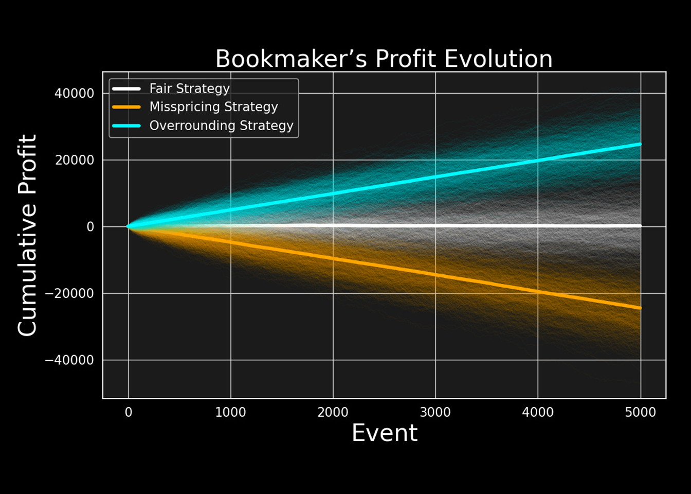

This is the first in a series of posts on modeling fixed-odds betting markets. To understand how these markets function, we must first look at the 'supply' side, the bookmaker, and one fundamental mechanism they use to survive: **the Overround**.

In fixed-odds betting markets, bookmakers offer positive payouts for mutually exclusive outcomes of a sporting event. This means they are guaranteed to pay out to some bettors based on the outcome that occurs. 

So, how do bookmakers ensure that these guaranteed payouts don’t lead to losses that could put them out of business, and instead, remain profitable?

## The Bookmaker’s Problem

I stick with the decimal representation of odds so that $O_i = 1.5$ means that each unit wagered on the outcome $R_i$ will return 1.5 units if that outcome is realized. For example, with odds 1.5, a $10 winning bet will result in a $15 payout for a profit of $5.

To visualize the problem, consider a simple **coin flip**. In a perfectly fair world, the odds for both Heads and Tails would be 2.0. If $\$100$ is bet on Heads and $\$100$ on Tails, the bookmaker cashes in $\$200$ and pays out exactly $\$200$ to the winners—netting zero profit.

A bookmaker, however, might offer odds of 1.90 for both. Now, they still cash in $\$200$, but only pay out $\$190$ to the winner. That $\$10$ difference is the **Overround** in action. It ensures, under certain conditions, that regardless of how the coin lands, the bookmaker retains a portion of the total wagers.

The bookmaker’s problem starts from the fact that on all prices he sets, the profit for the bettor must be greater than zero. In order to be attractive for wagerers, all the odds the bookmaker provides must result in a wagerer’s profit in case of victory. Nobody would bet on an outcome just for the sake of risking losing money!

What follow in an analytical and empirical analysis of the overround.

### Defining a Book

For a future event with a number of $N$ mutually exclusive possible outcomes, define a **Book** on that event as a finite set of mapping rules $\Omega$, where:

*   For each of $N$ mutually exclusive event’s outcomes $R_i$ with $i = \{1, 2, \dots, N\}$ there is a payout coefficient $O_i$ we refer to as **Odds**.
*   The odds for an outcome $i$ represent the amount of units the bookmaker will return for each unit wagered on that outcome if it actually happens.

In defining $\Omega$, the bookmaker must respect the following constraint over the decimal odds he sets over $N$ mutually exclusive outcomes:

$$O_i > 1 \quad \forall i \in \{1, \dots, N\} \tag{1}$$

Condition (1) implies that a payout is inevitable for the bookmaker on at least one outcome. Take as an example a football match where the bookmaker offers odds greater than 1 for both Team A and Team B. In order not to incur a loss, the bookmaker must be sure that what he pays to winning bets is less than what he cashes in from losing bets. 

## The Overround

By denoting the outcome probability with $P_i$, and the amount of units wagered on the outcome with $W_i$, the bookmaker’s profit if outcome $i$ occurs is:

$$\text{Profit}_i = W_{\text{total}} - O_i W_i \tag{2}$$

Which conveniently simplifies to the total **Expected Profit** for the entire book $\Omega$:

$$E[\text{Profit}] = \sum_{i=1}^N P_i (W_{\text{total}} - O_i W_i) \tag{3}$$

In the context of a fair game, the payout coefficient expressed as decimal odds for any outcome is the inverse of the outcome’s underlying probability:

$$O_i^{\text{fair}} = \frac{1}{P_i} \tag{4}$$

So, the inverse of the decimal odds in $\Omega$ for outcome $i$ gives us the bookmaker’s **Implied Probability** for that outcome:

$$\hat{P}_i = \frac{1}{O_i} \tag{5}$$

By using (5), the bookmaker’s expected profit in equation (3) can be rewritten as:

$$E[\text{Profit}] = \sum_{i=1}^N W_i \left( 1 - \frac{P_i}{\hat{P}_i} \right) \tag{6}$$

By examining equation (6), it is clear that for the expected profit to be positive, $\Omega$ must be structured so that the implied probabilities are bigger than the outcomes’ probabilities:

$$\hat{P}_i > P_i \tag{7}$$

As long as the condition from (7) is verified, the bookmaker's expected profit (6) is positive irrespective of the event’s outcome, and independently from the distribution of wagers. In other words, long-term profitability is ensured as long as the odds offered are always smaller than the fair odds:

$$O_i < O_i^{\text{fair}} \tag{8}$$

Given a book $\Omega$, the overround can be calculated from empirical data as follows:

$$\text{Overround} = \left( \sum_{i=1}^N \frac{1}{O_i} \right) - 1 \tag{9}$$

## Empirical Evidence

The plot below shows the percentage overround for Wimbledon 2023 matches calculated using historical odds offered by Bet365. For the 127 tennis matches considered, the bookmaker’s overround ranges from 1.95% to 5.9% with the most frequent overround percentage being around 5.55%.

## Simulation Study

This section briefly illustrates the effectiveness of overrounding using a small simulation study.

**Setting**
*   A series of 5000 sport events is simulated with each event having two possible outcomes: either Team A wins or Team B wins.
*   The underlying outcomes’ probabilities are set to .8 and .2 respectively.
*   On each event, 50 units are wagered on Team A and 50 units on Team B.
*   **Bookmaker 1** always offers odds correctly reflecting the outcomes’ probabilities (**Fair Strategy**).
*   **Bookmaker 2** makes mispricing mistakes offering odds 5% higher than the fair odds (**Mispricing Strategy**).
*   **Bookmaker 3** applies an overround of 5% (**Overrounding Strategy**).

**Results**
The results below compare the evolution of the bookmakers’ profits under the three different pricing strategies.

As can be seen after 5000 events:
*   The bookmaker adopting the **Overround Strategy** is highly profitable with an average expected cumulative profit above 20,000 units.
*   The bookmaker offering **Fair Odds** has profits and losses balancing each other, ending up with no profit.
*   The bookmaker who is **Mispricing** the outcomes is losing more than -20,000 units.

## Final Remarks

The overround is a bookmaking tactic which consists of offering odds based on inflated estimates of the outcomes' probabilities. Under certain conditions, this tactic allows the bookmaker to be profitable in the long run thanks to the expected value of his books designed to consistently be in his favor.

Overrounding however, isn’t the only tool used by bookmakers to design profitable pricing systems. Other factors, such as wagers preferences must be taken into account as they can have a considerable impact on the bookmaker overall profitability.

In a future post, I will explore the scenarios where an overround alone isn't enough to guarantee success, and how bookmakers react to protect their bottom line.

