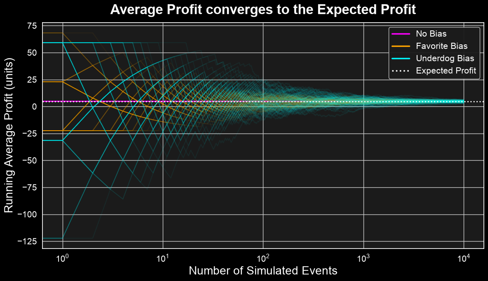
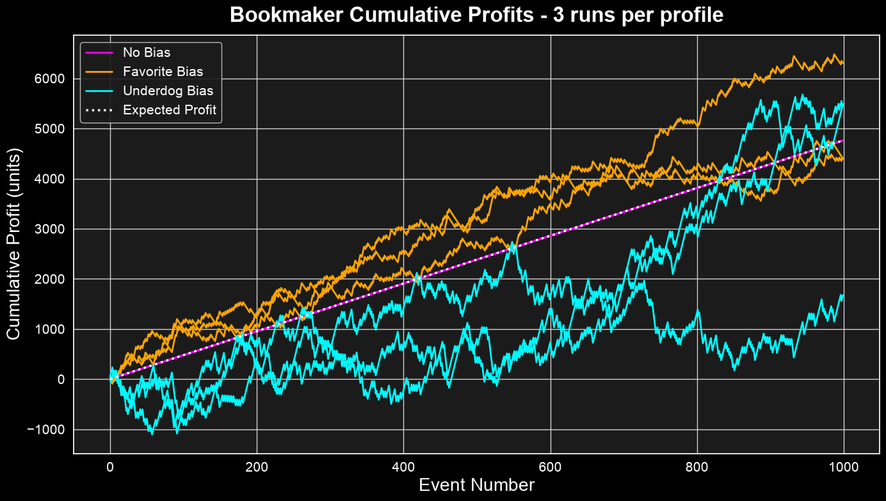
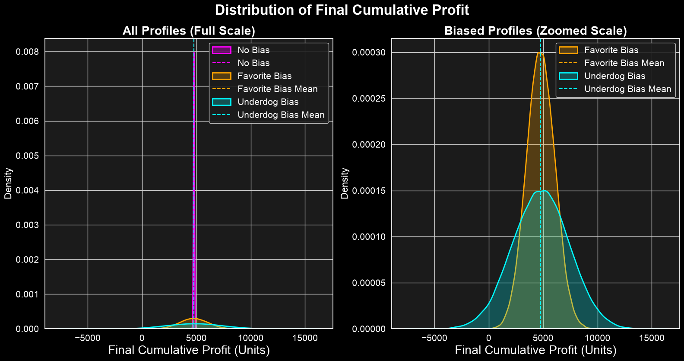
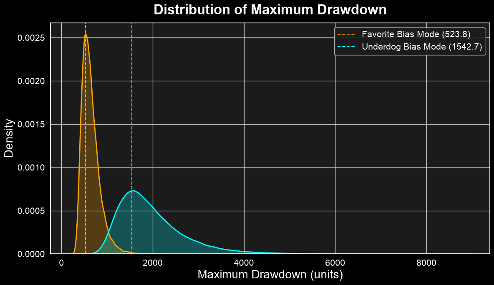

Building on the previous analysis of the overround, this post shows that a bookmaker's profit is contingent upon the distribution of wagers. This highlights that the overround guarantees profit only when certain conditions of bettor behavior are met. In order to minimize risk, balancing the book will require additional approaches to account for bettors' preferences.

## 1. Expected Profit is Independent of Bettor Preferences

Let's start by showing that when the bookmaker offers odds consistent with the outcome probabilities, their expected profit is constant: it is completely independent of the bettor preferences $w_i$, and depends only on the total pool of wagers $W_{\text{total}}$ and the overround $\epsilon$. 

Consider a sporting event with $N$ mutually exclusive outcomes $R_1, R_2, \dots, R_N$.

- Let $P_i$ be the **true underlying probability** of outcome $R_i$, where $\sum_{i=1}^N P_i = 1$.

- Let $O_i$ be the **decimal odds** offered by the bookmaker for outcome $R_i$.

- Let $W_i$ be the **total amount wagered** by bettors on outcome $R_i$, and $W_{\text{total}} = \sum_{i=1}^N W_i$ be the total pool of wagers.

- Let $w_i = \frac{W_i}{W_{\text{total}}}$ be the **proportion of wagers** placed on outcome $R_i$, where $\sum_{i=1}^N w_i = 1$.

If outcome $R_i$ is realized, the bookmaker must pay out $O_i W_i$ to winning bettors. The bookmaker's realized profit is:
$$\text{Profit}_i = W_{\text{total}} - O_i W_i = W_{\text{total}} (1 - O_i w_i) \tag{1}$$

The expected profit for the bookmaker is the probability-weighted sum of the profit under each outcome:
$$E[\text{Profit}] = \sum_{i=1}^N P_i \text{Profit}_i = W_{\text{total}} \left( 1 - \sum_{i=1}^N P_i O_i w_i \right) \tag{2}$$

An omniscient bookmaker knows the true probabilities $P_i$. To guarantee an expected profit, they set the decimal odds $O_i$ by inflating the true probabilities with an overround $\epsilon > 0$. The implied probabilities $\hat{P}_i$ are set as:
$$\hat{P}_i = P_i (1 + \epsilon) \tag{3}$$
So that the sum of implied probabilities is $\sum_{i=1}^N \hat{P}_i = 1 + \epsilon$.

The decimal odds are the reciprocal of the implied probabilities:
$$O_i = \frac{1}{\hat{P}_i} = \frac{1}{P_i (1 + \epsilon)} \tag{4}$$

Substituting $O_i$ into the expected profit equation:
$$\begin{aligned}
E[\text{Profit}] &= W_{\text{total}} \left( 1 - \sum_{i=1}^N P_i \left( \frac{1}{P_i (1 + \epsilon)} \right) w_i \right) \\
&= W_{\text{total}} \left( 1 - \frac{1}{1 + \epsilon} \sum_{i=1}^N w_i \right)
\end{aligned} \tag{5}$$

Since $\sum_{i=1}^N w_i = 1$, the bettors' preferences become irrelevant in determining the expected profit:
$$E[\text{Profit}] = W_{\text{total}} \left( 1 - \frac{1}{1 + \epsilon} \right) = W_{\text{total}} \left( \frac{\epsilon}{1 + \epsilon} \right) \tag{6}$$

### Simulation

In this Monte Carlo simulation, I test the impact of different bettor allocation preferences on the bookmaker's average profit.

**Bookmaker**

In the simulation, the bookmaker targets a profit margin (overround) of $\epsilon = 5\% = 0.05$ and offers odds consistent with the true outcome probabilities plus the overround: $\hat{P}_j = P_j (1 + \epsilon) \implies \hat{P} = [0.735, 0.315]$ with decimal odds $O_j = \frac{1}{\hat{P}_j} \implies O \approx [1.3605, 3.1746]$.

**Bettors**

I consider three distinct structures for bettor preferences:

1. **No Bias ($w = P$)**: Bettors align their wagers perfectly with the underlying true probabilities $[0.7, 0.3]$, thus placing $70\%$ of their wagers on the Favorite and $30\%$ on the Underdog.

2. **Favorite Bias ($w = [0.9, 0.1]$)**: Bettors place $90\%$ of their wagers on the Favorite and only $10\%$ on the Underdog (over-backing the Favorite).

3. **Underdog Bias ($w = [0.3, 0.7]$)**: Bettors place $30\%$ on the Favorite and $70\%$ on the Underdog (over-backing the Underdog).

**Runs**

I simulate 100 independent series of 10,000 consecutive events each. The outcomes of each event are sampled randomly from the true distribution $P$. For each event, a constant total wager volume of $W_{\text{total}} = 100$ units is placed. The wager preferences represent the share of the total pool placed on each outcome. We compute the running average profit for each series.

**Results**

As shown in the plot below, in the long run the bookmaker's running average profit converges to the expectation regardless of the bettors' preference structure ($E[\text{Profit}] \approx 4.76$ units). **Does this mean that the bookmaker can treat the bettors' preferences as a nuisance when balancing their book? Absolutely not!**

It is important to note that when facing biased bettor profiles, the bookmaker's average profit presents considerable variability before converging. In the next section, I show that the variability introduced by biased bettor preferences is a source of risk and potential liability for the bookmaker.

## 2. The Actual Profits is Impacted by Bettors' Preferences

Good estimates of outcome probabilities and the application of the overround are not sufficient to protect the bookmaker from risk and liability. If wager shares depart from the outcome probabilities and the bookmaker ignores this distribution, they can suffer significant losses.

To show this, consider the variance of the bookmaker's profit across outcomes:
$$\text{Var}(\text{Profit}) = \sum_{i=1}^N P_i \left( \text{Profit}_i - E[\text{Profit}] \right)^2 \tag{7}$$

Substituting the formulas for $\text{Profit}_i$ and $E[\text{Profit}]$:
$$\begin{aligned}
\text{Profit}_i - E[\text{Profit}] &= W_{\text{total}} \left( 1 - \frac{w_i}{P_i (1+\epsilon)} \right) - W_{\text{total}} \left( \frac{\epsilon}{1+\epsilon} \right) \\
&= W_{\text{total}} \left( \frac{1 + \epsilon - w_i / P_i - \epsilon}{1+\epsilon} \right) \\
&= \frac{W_{\text{total}}}{1+\epsilon} \left( 1 - \frac{w_i}{P_i} \right)
\end{aligned} \tag{8}$$

Thus, the variance is:
$$\begin{aligned}
\text{Var}(\text{Profit}) &= \sum_{i=1}^N P_i \left[ \frac{W_{\text{total}}}{1+\epsilon} \left( 1 - \frac{w_i}{P_i} \right) \right]^2 \\
&= \frac{W_{\text{total}}^2}{(1+\epsilon)^2} \sum_{i=1}^N P_i \left( \frac{P_i - w_i}{P_i} \right)^2 \\
&= \frac{W_{\text{total}}^2}{(1+\epsilon)^2} \sum_{i=1}^N \frac{(w_i - P_i)^2}{P_i}
\end{aligned} \tag{9}$$

The variance of the profit is directly proportional to the **$\chi^2$ distance** between the wager distribution $w$ and the true probability distribution $P$:
$$\text{Var}(\text{Profit}) = \frac{W_{\text{total}}^2}{(1+\epsilon)^2} D_{\chi^2}(w \parallel P) \tag{10}$$

From this relation, we can draw two crucial conclusions:

- The variance is zero if and only if $w_i = P_i$ for all $i$. In this case, the bookmaker is perfectly hedged and earns a risk-free profit of $W_{\text{total}} \frac{\epsilon}{1+\epsilon}$ regardless of which outcome occurs.

- If the wager distribution $w$ deviates from the true probabilities $P$, the variance increases. If $w_i > P_i (1+\epsilon)$ for some outcome $i$, the realized profit $\text{Profit}_i$ becomes negative, meaning the bookmaker will suffer a net loss if outcome $R_i$ is realized.

### Simulation

I use a battery of simulations to examine how the bookmaker's cumulative profit behaves when facing different bettor preference structures.

The first plot shows three cumulative profit series for each preference structure. When wagers are placed consistently with the outcome probabilities ('No Bias'), the bookmaker's profit increases linearly with zero deviation from the expectation. On the contrary, in scenarios where wager allocation departs from the underlying outcome probabilities, the profit exhibits massive swings.

Instead of looking at just a handful of series, the plot below shows the distributions of the final cumulative profit with 50,000 simulated series for each bettor preference structure.

As can be seen, the distributions in all cases have a mean consistent with the expectation. However, while the No Bias case has no profit variance (left plot), in both biased cases the variance across the different realizations is considerable, and the actual final profit can be zero or less (right plot). 

Furthermore, aside from the final profit, we recorded that 87.936% of the Favorite Bias simulations dropped to zero or below at some point, while this figure rose to 91.266% for the Underdog Bias simulations.

Instead of considering the final profit, the next plot shows the distribution of the maximum drawdown defined as the largest drop from a historical peak before a new peak is achieved. For the sake of scale clarity, the situation with No Bias is excluded from the plot since it increases monotonically at each step (std = 0.00), meaning it has exactly zero drawdown on all paths.

As can be seen, both bettor profiles generate a considerable risk of drawdown for the bookmaker, with the Underdog Bias profile being the most severe.

## 3. Conclusions

The overround guarantees an actual profit for the bookmaker only when the bettors' preferences are aligned with the outcome probabilities. 

In contrast, when the bettors' preferences deviate from the outcome probabilities, the bookmaker's actual profit can be significantly lower than the expected profit. 

The risk of large drawdowns emphasizes the critical importance for bookmakers to actively manage and balance their books, rather than passively accepting the distribution of wagers.

In the next post of this series, I will discuss how bookmakers account for bettors' behavior to balance their books and protect their profit.